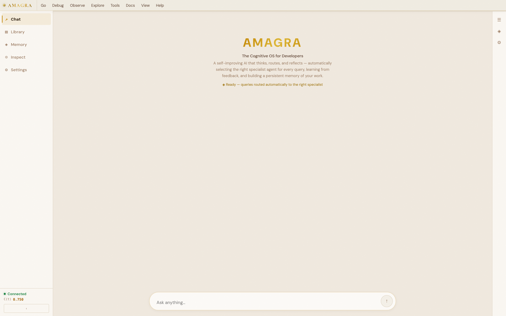
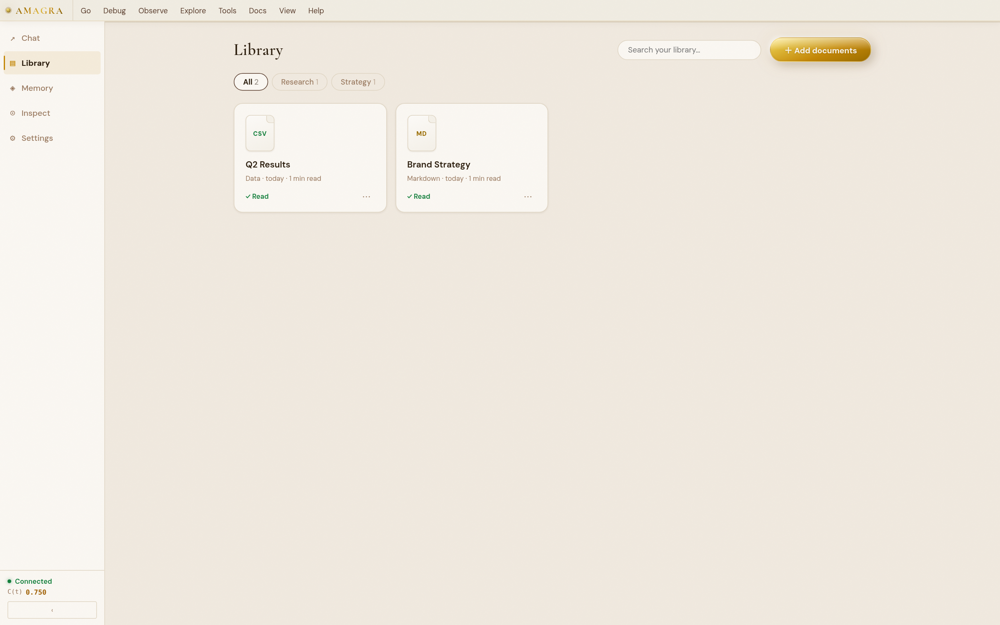
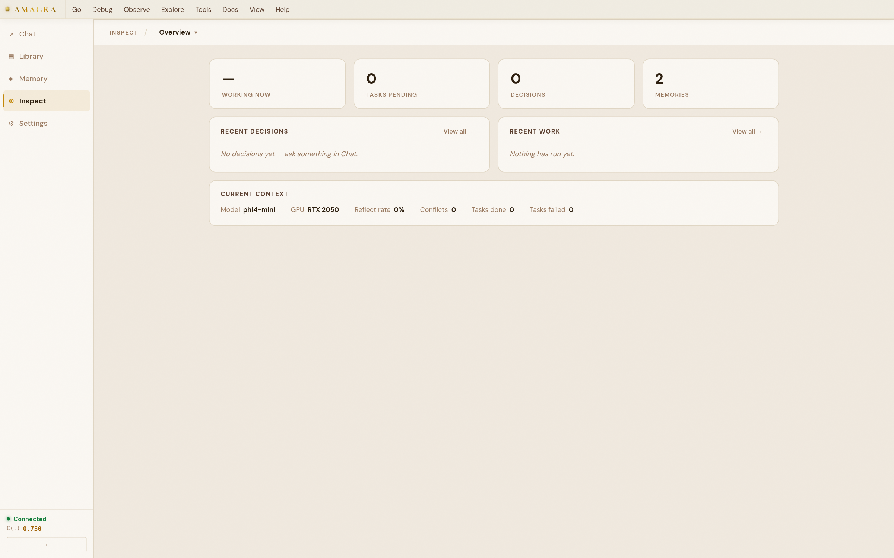

# Amagra

**Self-hosted AI that remembers your work, explains every decision, and runs entirely on your hardware.**



<p align="center">
  
  
</p>

---

## What you get

- **Full observability** — every routing decision, memory retrieval, and reflection is browsable in the UI; nothing is a black box
- **Persistent semantic memory** — FAISS vector search across sessions, 52× LRU cache speedup; the system remembers context you'd otherwise re-explain
- **Sub-second routing** — signal-first heuristics classify most queries in ~1 ms without an LLM call, then escalate to reasoning only when genuinely ambiguous
- **10 domain-tuned agents**: Python, .NET, Web, DevOps, Data, AI/ML, IT Networking, Writer, Knowledge, Terse
- **Conversation threading** — each thread carries the last 4 turns of context; switch projects without re-explaining yourself
- **Free to self-host** — MIT licensed, Docker + Ollama, runs on consumer CPU or GPU, nothing leaves your machine

---

## Metrics

| Metric | Value | Notes |
|---|---|---|
| Signal-first routing (curated eval) | **99%** | 138-query ablation, same set used for tuning — not an independent benchmark |
| Memory retrieval (FAISS, warm) | **< 1 ms** | LRU cache hit |
| Memory retrieval (cold embed) | ~60–80 ms | nomic-embed-text via Ollama |
| Skill graph coverage | **21 nodes** | Phrase-weighted disambiguation across all 10 agents |
| Free tier | **100 req / day** | No card required — `POST /register/free` |

> Real-world routing accuracy is tracked via telemetry (`GET /telemetry/routing`) from actual usage. The curated-eval figure above is an internal benchmark — treat it as indicative, not definitive.

---

## Quick start

**Docker (recommended):**

```bash
git clone https://github.com/d4shm1r/amagra
cd amagra
docker compose up
```

Pull the models on first run:

```bash
docker exec agentic-ollama ollama pull nomic-embed-text
docker exec agentic-ollama ollama pull phi4-mini
```

- UI: http://localhost:3000
- API docs: http://localhost:8000/docs

> **No GPU?** Remove the `deploy` section from `docker-compose.yml`. Embedding runs on CPU (~2–3s cold, < 1ms warm via LRU).

**Without Docker:**

```bash
python -m venv .venv && source .venv/bin/activate
pip install -r requirements.txt
ollama pull nomic-embed-text && ollama pull phi4-mini
uvicorn api:app --host 0.0.0.0 --port 8000 &
cd ui && npm install && npm start
```

Reproduce the routing benchmark (no Ollama required):

```bash
python3 -m venv .venv && source .venv/bin/activate
pip install -r requirements.txt
make benchmark
```

---

## Architecture

```
User query
    │
    ▼
QuerySignal  (~1 ms — domain, shape, verbosity heuristics — high-confidence direct route)
    │
    ├─► Direct route  (high-confidence domain match)
    │
    └─► CoreBrain     (LLM reasoning — ambiguous queries only)
            │
            └─► Coordinator (LangGraph)
                    │
                    ├─► Risk gate  (reflect_level: none / light / full)
                    │
                    └─► Specialist agent
                            │
                            ├─► Skill graph disambiguation (21 nodes)
                            ├─► FAISS memory retrieval (< 1 ms warm)
                            ├─► Ollama LLM inference
                            ├─► Critic gate  (score ≥ 0.70 or regenerate)
                            └─► Step verifier  (pass / fail → event_bus)
```

**Memory pipeline:** SQLite → auto-promote to FAISS at 800 entries → cosine similarity → outcome-weighted quality scoring → LRU cache

**Learning loop:** critic gate scores (0.0–1.0) feed `apply_learning_update()` after each response. Scores are stored in SQLite alongside the query, agent, and routing path. The coordinator uses these to adjust per-agent selection confidence on similar future queries — high-scoring paths are preferred, low-scoring paths trigger retry or escalation. Model parameters are not modified; only coordinator-level routing and retry weights change.

---

## Routing in practice

QuerySignal classifies by domain signal — keyword patterns, code syntax, question shape — not intent inference. Below are representative examples from the 138-query evaluation set:

| Query | Routed to | Primary signal |
|---|---|---|
| "Write a pandas groupby with multi-level index" | Data | `pandas`, dataframe vocabulary |
| "Configure OSPF on a Cisco switch" | Networking | protocol name + network device |
| "Fix this LINQ query throwing NullReferenceException" | .NET | `LINQ`, C# exception |
| "Make this explanation shorter" | Terse | brevity instruction |
| "Debug my Dockerfile — build fails at RUN pip install" | DevOps | `Dockerfile`, build toolchain |
| "Explain gradient descent intuitively" | AI/ML | ML terminology |
| "My SSH tunnel keeps dropping after 60s" | Networking | SSH, connectivity timeout |
| "Summarise this RFC for a non-technical audience" | Writer | audience framing |
| "Plot a confusion matrix from sklearn predictions" | Data | visualization + ML library |
| "Write a Python async context manager" | Python | language + stdlib pattern |

Curated eval result: **137 correct, 1 incorrect** (138 queries).

The one miss: *"Write a script to analyse server logs"* routed to Data instead of DevOps — scripting-for-analysis vs scripting-for-operations is a known ambiguity at the boundary between those two agents.

### Known routing overlaps

Three domain pairs produce the most misroutes in practice:

- **Python ↔ Data** — data manipulation queries without an explicit library reference can land on either
- **DevOps ↔ Networking** — infrastructure questions that span server config and network topology
- **Writer ↔ Knowledge** — documentation requests sometimes select Writer when the user wants a factual lookup

These are visible in live telemetry (`GET /telemetry/routing`). The curated eval deliberately includes overlap cases.

---

## API

```bash
# Ask a question (auto-routed)
curl http://localhost:8000/ask \
  -H "Content-Type: application/json" \
  -d '{"message": "Write a Python async context manager"}'

# Continue a conversation thread
curl http://localhost:8000/ask \
  -H "Content-Type: application/json" \
  -d '{"message": "Add error handling to that", "thread_id": "your-thread-id"}'

# Force a specific agent
curl http://localhost:8000/ask \
  -H "Content-Type: application/json" \
  -d '{"message": "...", "force_agent": "python_dev"}'

# List conversation threads
curl http://localhost:8000/threads

# Memory health
curl http://localhost:8000/memory/stats

# Live routing telemetry
curl http://localhost:8000/telemetry/routing

# System intelligence score
curl http://localhost:8000/cos/uci/hierarchical

# Active execution plan (DAG)
curl http://localhost:8000/plan/graph

# Recent events
curl http://localhost:8000/cos/events?n=20
```

Full API docs at `http://localhost:8000/docs`.

---

## Cognitive OS

Amagra ships a runtime layer that makes agent behaviour observable and steerable at every step.

| Component | What it does |
|---|---|
| `event_bus` | Typed pub/sub — every routing decision, plan step, verification, and memory retrieval emits an event |
| `world_model` | Session-scoped working context — tracks current goal, known issues, named entities, and completed tasks for the active request; reset between sessions |
| `cognitive_state` | Request lifecycle — begin → route → execute → reflect → end, tracked as structured data |
| `metrics_engine` | Computes four live counters from session events: Reliability (error rate), Intelligence (routing precision), Adaptation (learning updates applied), Productivity (tasks completed per session) |
| `skill_graph` | 21-node skill disambiguation layer, phrase-weighted scoring, resolves edge-case routing ambiguity |
| `step_verifier` | Scores each agent response after execution — pass/retry/abort recommendation to the coordinator |
| `suggestion_engine` | Reads world model issues and failed events, generates proactive action suggestions in the UI |

All of this is browsable in real time from the UI: Event Log, Plan Graph, Metrics Dashboard, Risk Observatory, Memory Browser, Decision Replay.

---

## Auth

Auth is **disabled by default** for local development. Enable it:

```bash
REQUIRE_AUTH=1 ADMIN_TOKEN=your-secret uvicorn api:app ...
```

**Self-service free tier** (100 req/day, no card):

```bash
curl -X POST http://localhost:8000/register/free \
  -H "Content-Type: application/json" \
  -d '{"email": "you@example.com", "name": "Your Name"}'
```

**Create a managed API key** (admin):

```bash
curl -X POST http://localhost:8000/admin/keys \
  -H "Authorization: Bearer your-secret" \
  -H "Content-Type: application/json" \
  -d '{"owner": "alice@example.com", "tier": "developer"}'
```

Rate limits are returned on every authenticated response as `X-RateLimit-Limit`, `X-RateLimit-Used`, `X-RateLimit-Remaining`.

---

## Known limitations

- **Streaming available** — use `POST /ask/stream` for SSE streaming responses. When `ANTHROPIC_API_KEY` is set, tokens stream directly from Claude; without it, the response arrives as a single chunk. The default `POST /ask` remains non-streaming.
- **No tool use** — agents produce text only. File access, sandboxed code execution, and web search are committed for `v1.1`.
- **Default inference** — Ollama (local). Cloud provider support (Anthropic, OpenAI, Gemini) via the multi-provider `/ask` path is available; full provider-abstraction UI is committed for `v1.0`.
- **SQLite sprawl** — internal data is split across multiple SQLite files. Cross-DB atomicity is not guaranteed. Consolidation into a single `amagra.db` is planned for `v0.10`.
- **Benchmark independence** — routing accuracy is measured on a curated eval set, not production data. See [Routing in practice](#routing-in-practice) for the raw numbers and known failure modes. Independent production telemetry is tracked via `GET /telemetry/routing`.

---

## Roadmap

Amagra is evolving toward a provider-agnostic runtime where models, embeddings, and agents can be added without changing the core memory, routing, or observability systems. Commitments are published in the app under **Promises** — explicit delivery targets, not a wishlist.

### Phase 1 — Provider abstraction · v0.9.3 · Q3 2026

Introduce internal provider interfaces (`ModelProvider`, `EmbeddingProvider`) so the runtime is not coupled to Ollama.

Ollama becomes the first adapter. This phase is intentionally infrastructure-only — no new UI yet. Goal: stable abstraction boundaries before adding model backends.

Also in this phase: single consolidated `amagra.db`, independent production telemetry. SSE streaming shipped early via `POST /ask/stream`.

### Phase 2 — Multi-provider models · v1.0 · Q3 2026

Add support for additional inference backends:

| Provider | Type |
|---|---|
| Ollama | Local inference (default) |
| Anthropic | Cloud inference |
| OpenAI | Cloud inference |
| Gemini | Cloud inference |
| OpenAI-compatible endpoints | Self-hosted models (vLLM, LM Studio, etc.) |

Users select inference model per workspace. Routing, memory, and telemetry are unaffected — the provider swap happens below the coordinator.

Also in this phase: file and folder context, sandboxed code execution, live web search.

### Phase 3 — Agent configuration · v1.1 · Q3 2026

Allow users to enable/disable agents per workspace and adjust routing preferences. Custom workspace agent sets. Routing continues through QuerySignal and coordinator telemetry.

### Phase 4 — Agent SDK · v1.2 · Q4 2026

A supported interface for building custom agents. Agents declare a manifest:

```yaml
id: security_auditor
name: Security Auditor
skills: [security, pentesting, compliance]
keywords: [cve, owasp, threat model, audit]
routing_examples:
  - "Review this code for injection vulnerabilities"
  - "Write a threat model for this API"
confidence_threshold: 0.75
capabilities: [memory, coding]
```

The runtime automatically incorporates registered agents into routing, telemetry, and observability. Custom agents get memory, critic gate, and step verification for free.

### Phase 5 — Importable agent packs · v1.3 · Q1 2027

Agents as portable artifacts. Export, import, and share agent packs as YAML or ZIP. All imported agents participate in memory retrieval, routing telemetry, and execution tracing.

### Phase 6 — Registry · v2.0 · 2027

A curated registry of official and community agents, tiered by trust:

| Tier | Description |
|---|---|
| Official | Maintained by Amagra, benchmarked, supported |
| Verified community | Third-party, reviewed, clearly labelled |
| Local | User-created, no quality guarantees |

Amagra remains responsible for runtime infrastructure. Agent capabilities become extensible without compromising runtime quality.

---

> The goal is for every new model and every new agent to increase the value of Amagra's runtime — not compete with it. The memory, routing, and observability layers are the product. Models and agents are adapters.

---

## Contributing

Issues and PRs welcome. The codebase is structured so that adding a new agent requires changes to exactly two files — see `agents/python_dev.py` as a reference and `agents/registry.py` for registration.

Run the test suite:

```bash
pytest tests/
```

Run the routing benchmark:

```bash
PYTHONPATH=. python3 evaluation/ablation_eval.py
```

---

## License

MIT © 2026 — self-hosting is free and always will be.

Managed hosting, enterprise CoA audit trail, and domain agent packs are paid tiers: [amagra.dev](https://amagra.dev)
